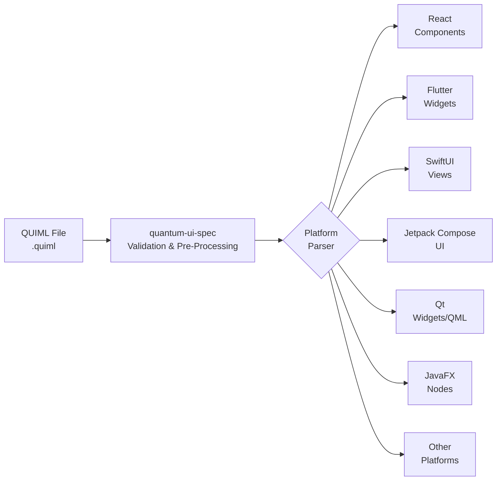

# Quantum UI Framework (QUIML)

<div align="center">

   

**The Universal UI Framework for AI-Driven Applications**

[Documentation](https://github.com/quantum-ai-suite/quantum-community-hub/wiki) | [Issues](https://github.com/quantum-ai-suite/quantum-community-hub/issues) | [Discussions](https://github.com/orgs/quantum-ai-suite/discussions)| [Examples](https://github.com/quantum-ai-suite/quantum-ui-examples) | [Playground](https://quantumsuite.ai/playground)

</div>

## Overview

QUIML (Quantum User Interface Markup Language) is a declarative, extensible UI framework designed for creating futuristic, cross-platform user interfaces. Inspired by quantum-inspired innovation and aligned with the Quantum Suite ecosystem, QUIML provides a modern alternative to traditional UI languages like JavaFX FXML. It supports web (React), desktop (Qt/Tauri, JavaFX), mobile (Flutter, SwiftUI, Jetpack Compose), and multi-language controllers (JavaScript, Python, C++, Java). QUIML emphasizes modularity, AI integration, and dynamic styling, enabling developers to build responsive, interactive UIs with a professional aesthetic.

As of October 18, 2025, QUIML is at version 1.1, featuring hybrid styling, a new "library" section for reusable assets (e.g., SVGs, images, icons), detailed syntax with pre-processor support, AI integration strategies, build-time prompt compilation, and expanded implementation packages.

### Key Features

- **Cross-Platform Compatibility**: Render the same QUIML file across Web (React v19.2), Desktop (Qt 6.10, JavaFX 25), Mobile (Flutter, SwiftUI, Jetpack Compose), and more.
- **Multi-Language Controllers**: Support for JavaScript, Python, C++, and Java controllers with a unified interface.
- **Extensibility**: User-defined attributes, behaviors, types, and custom registrations via APIs like `QUIML.registerType`.
- **Hybrid Styling**: Inline attributes, top-level "style" sections (QUIML-CSS subset with variables, selectors, pseudo-selectors), and external CSS for portability and consistency.
- **AI-Ready**: Integrates with WebSocket/GraphQL for real-time updates; supports AI-generated prompts for automated design and dynamic content.
- **Asset Library**: New "library" section for defining and referencing reusable assets like SVGs, images, and icons.
- **Canvas Module**: Extensible 2D/3D graphics support with primitives, operations, animations, and backend abstractions (e.g., WebGL/Three.js r172, Skia).
- **Performance & Security**: Optimized parsers, safe YAML handling, sandboxed controllers, and integration with Quantum Suite tools like Quantum Watch and Quantum Security.

## Repository Structure

The Quantum UI ecosystem consists of multiple repositories, each serving a specific purpose:

```
quantum-ai-suite/
├── quantum-ui-spec/          # You are here - Specifications & Documentation
├── quantum-ui-react/      # JavaScript/React implementation (Web)
├── quantum-ui-flutter/  # Dart/Flutter implementation (iOS/Android/Web/Desktop)
├── quantum-ui-swiftui/ # Swift/SwiftUI implementation (iOS/macOS)
├── quantum-ui-compose # Kotlin/Jetpack Compose implementation (Android)
├── quantum-ui-qt/        # C++/Qt implementation (Desktop cross-platform)
├── quantum-ui-javafx/   # Java/JavaFX implementation (Desktop/Java environments)
├── quantum-ui-pyqt/   # Python/PyQt implementation (Desktop cross-platform)
├── quantum-ui-reactnative # JavaScript/React Native implementation (iOS/Android/Web)
├── quantum-ui-maui/   # C#/.NET MAUI implementation (Windows/Android/iOS/macOS)
├── quantum-ui-slint/    # Rust/Slint implementation (Desktop/Mobile/Embedded)
└── quantum-ui-examples/      # Example QUIML files, static/mobile demos, and Canvas usage
```

### How It Works



1. **Write** your UI in QUIML (relaxed YAML syntax).
2. **Pre-Process & Validate** using tools from this repo (handles inline mappings, quoting for specials like `#`).
3. **Parse & Render** via platform-specific packages, merging hybrid styles and referencing libraries.
4. **Extend** with AI prompts, custom types, or controllers for dynamic behavior.

## Repository Roles

### quantum-ui-spec (This Repository)

**Purpose**: Central hub for specifications, documentation, and coordination. This is the primary repo for all QUIML-related discussions and changes.

- **Specifications**: Core QUIML syntax (v1.1), component schemas, API contracts, Canvas module, and extensibility details.
- **Documentation**: Comprehensive guides, tutorials, best practices, and API references.
- **Test Suites**: Compliance tests that all implementations must pass.
- **Tools**: Reference validator, preprocessor (JavaScript/Python/Java implementations), and example scripts.
- **Community**: Issues, discussions, RFCs, and roadmap for the entire ecosystem.

**This is the only repository with:**

- Wiki (comprehensive documentation)
- Issues (for all UI-related bugs/features across platforms)
- Discussions (community forum)
- Projects (roadmap tracking)

Platform-specific repos focus solely on implementation code, dependencies, and build tools. All specs, examples, and coordination happen here.

## Getting Started

### Installation

For development and validation tools:

```bash
# Install global CLI tools (Node.js required for JS-based tools)
npm install -g @quantum-ui/validator @quantum-ui/preprocessor

# Or use platform-specific packages (e.g., for Python)
pip install quantum-ui-python-tools
```

For platform implementations, install via respective package managers (e.g., npm for React, pub for Flutter). See individual repos for details.

### Writing a QUIML File

Create a `.quiml` file with relaxed YAML syntax:

```yaml
quiml: 1.1
library:
  - id: logo
    type: image
    src: quantum-logo.svg
style:
  :root { --qs-bg: #000000; --qs-accent: #00AEEF; }
  Button { background-color: var(--qs-bg); color: var(--qs-accent); }
components:
  - VerticalBox#main:
      components:
        - Image#logo: { ref: logo, size: 50px }
        - Button#action: { text: Get Started, style: { hover: { bg: #333333 } } }
controllers:
  - name: MainController
    language: javascript
    script: main.js
```

### Validating QUIML Files

```bash
# Validate a QUIML file
quiml-validate my-ui.quiml --schema=1.1
```

### Preprocessor for Relaxed Syntax

```bash
# Convert relaxed syntax to strict YAML
quiml-preprocess input.quiml > output.yaml
```

### Running Compliance Tests

All platform implementations must pass the compliance test suite:

```bash
# Clone this repo
git clone https://github.com/quantum-ai-suite/quantum-ui-spec
cd quantum-ui-spec

# Install dependencies
npm install

# Run compliance tests
npm test

# Test specific platform implementation (requires linking to platform repo)
npm test -- --platform=js-react
```

## Contributing

We welcome contributions! However, please note:

- **Issues**: File all issues in THIS repository (quantum-ui-spec), not in platform-specific repos. Use labels for categorization.
- **Discussions**: Use the Discussions tab here for questions, ideas, and feedback.
- **Platform Bugs**: Report even platform-specific bugs here with appropriate labels (e.g., `platform:js-react`).
- **Pull Requests**:
  - Spec changes, docs, tools, or tests: Submit to quantum-ui-spec.
  - Implementation changes: Submit to the specific platform repo.
  - Examples: Submit to quantum-ui-examples.

### Issue Labels

When filing issues, please use these labels:

- `spec` - Specification changes or clarifications
- `platform:js-react` - React/Web implementation specific
- `platform:dart-flutter` - Flutter implementation specific
- `platform:swift-swiftui` - SwiftUI implementation specific
- `platform:kotlin-compose` - Jetpack Compose implementation specific
- `platform:cpp-qt` - Qt implementation specific
- `platform:java-javafx` - JavaFX implementation specific
- `platform:python-pyqt` - PyQt implementation specific
- `platform:js-reactnative` - React Native implementation specific
- `platform:csharp-maui` - .NET MAUI implementation specific
- `platform:rust-slint` - Slint implementation specific
- `bug` - Something isn't working
- `enhancement` - New feature or request
- `documentation` - Documentation improvements
- `canvas` - Related to Canvas module (2D/3D graphics)

### Development Process

1. **Propose** - Open an issue or discussion for significant changes.
2. **Discuss** - Get community feedback.
3. **RFC** - For major features, create an RFC in the wiki.
4. **Implement** - Create PR with tests and documentation.
5. **Review** - Maintainers review and provide feedback.
6. **Merge** - Changes merged and released.

## Platform Feature Compatibility

| Feature         | js-react | dart-flutter | swift-swiftui | kotlin-compose | cpp-qt | java-javafx | python-pyqt | js-reactnative | csharp-maui | rust-slint |
| --------------- | -------- | ------------ | ------------- | -------------- | ------ | ----------- | ----------- | -------------- | ----------- | ---------- |
| Core Components | ✓        | ✓            | ✓             | ✓              | ✓      | ✓           | ✓           | ✓              | ✓           | ✓          |
| Layouts         | ✓        | ✓            | ✓             | ✓              | ✓      | ✓           | ✓           | ✓              | ✓           | ✓          |
| Animations      | ✓        | ✓            | ✓             | ✓              | ✓      | ✓           | ✓           | ✓              | ✓           | ✓          |
| Data Binding    | ✓        | ✓            | ✓             | ✓              | ✓      | ✓           | ✓           | ✓              | ✓           | ✓          |
| Hybrid Styling  | ✓        | ✓            | ✓             | ✓              | ✓      | ✓           | ✓           | ✓              | ✓           | ✓          |
| Asset Library   | ✓        | ✓            | ✓             | ✓              | ✓      | ✓           | ✓           | ✓              | ✓           | ✓          |
| Canvas 2D       | ✓        | ✓            | ✓             | ✓              | ✓      | ✓           | ✓           | ✓              | ✓           | ✓          |
| Canvas 3D       | ✓        | In Dev       | In Dev        | In Dev         | In Dev | In Dev      | In Dev      | In Dev         | In Dev      | In Dev     |
| AI Prompts      | ✓        | ✓            | ✓             | ✓              | ✓      | ✓           | ✓           | ✓              | ✓           | ✓          |
| Hot Reload      | ✓        | ✓            | ✓             | ✓              | ✗      | ✗           | ✗           | ✓              | ✗           | ✗          |

✓ Supported | In Dev = In Development | ✗ Not Supported

## Related Projects

- **[Quantum Suite](https://quantumsuite.ai/)** - AI-powered business operating system integrating QUIML.
- **[Quantum Business OS (QBOS)](https://github.com/quantum-ai-suite/qbos)** - Enterprise platform using QUIML for UIs.
- **[Quantum Watch](https://github.com/quantum-ai-suite/quantum-watch)** - Network performance monitoring with QUIML dashboards.
- **[Quantum Security](https://github.com/quantum-ai-suite/quantum-security)** - Security framework with QUIML-integrated access controls.
- **[Quantum Asset Licensor (QAL)](https://github.com/quantum-ai-suite/qal)** - Licensing system for Quantum products.

## License

This specification and reference tools are licensed under the MIT License. See [LICENSE](LICENSE) for details.

Individual platform implementations may have different licenses - check each repository for specifics.

## Acknowledgments

QUIML draws inspiration from:

- XAML (Microsoft)
- QML (Qt)
- SwiftUI (Apple)
- Flutter's widget system
- React's component model
- YAML-based declarative formats

Special thanks to the open-source community, xAI (Grok 4), and early adopters who helped shape this framework.

## Contact & Support

- **Issues**: [GitHub Issues](https://github.com/quantum-ai-suite/quantum-ui-spec/issues)
- **Discussions**: [GitHub Discussions](https://github.com/quantum-ai-suite/quantum-ui-spec/discussions)
- **Wiki**: [Documentation Wiki](https://github.com/quantum-ai-suite/quantum-ui-spec/wiki)
- **Email**: ui-team@quantumsuite.ai
- **Twitter**: [@QuantumSuiteAI](https://twitter.com/QuantumSuiteAI)
- **Discord**: [Join our Discord](https://discord.gg/quantumsuite)

------

<div align="center">

**Built with care by the Quantum AI Suite Team**

[Website](https://quantumsuite.ai/) | [Blog](https://quantumsuite.ai/blog) | [Careers](https://quantumsuite.ai/careers)

</div>
