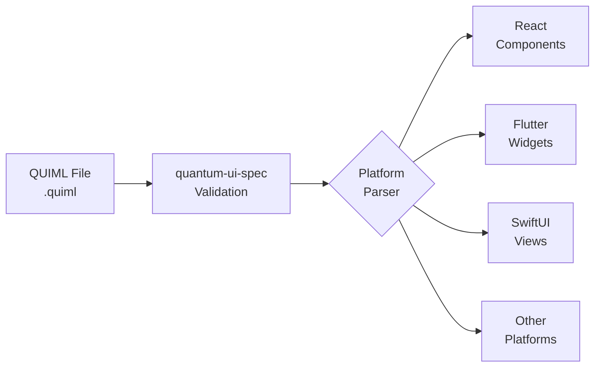

# Quantum UI Framework (QUIML)

<div align="center">

   

**The Universal UI Framework for AI-Driven Applications**

[Documentation](https://github.com/quantum-ai-suite/quantum-ui-spec/wiki) | [Issues](https://github.com/quantum-ai-suite/quantum-ui-spec/issues) | [Examples](https://github.com/quantum-ai-suite/quantum-ui-examples) | [Playground](https://quantumsuite.ai/playground)

</div>

## Overview

QUIML (Quantum User Interface Markup Language) is a declarative, cross-platform UI framework that enables developers to build modern, AI-driven interfaces using a single YAML-based syntax. Write once, deploy everywhere - from web browsers to native mobile apps to desktop applications.

### Key Features

- **One Syntax, All Platforms** - Single YAML definition renders across React, Flutter, SwiftUI, and more
- **AI-Native** - Built-in support for AI-generated UIs and dynamic content through prompt compilation
- **Extensible** - Register custom components, behaviors, and styling options
- **Performance First** - Optimized renderers for each platform's native capabilities
- **Developer Friendly** - Human-readable YAML with powerful tooling and validation
- **Enterprise Ready** - Part of the Quantum Suite business platform ecosystem

## Repository Structure

The Quantum UI ecosystem consists of multiple repositories, each serving a specific purpose:

```
quantum-ai-suite/
├── quantum-ui-spec/          # You are here - Specifications & Documentation
├── quantum-ui-react/         # React/Web implementation
├── quantum-ui-flutter/       # Flutter implementation (iOS/Android)
├── quantum-ui-swiftui/       # SwiftUI implementation (iOS/macOS)
├── quantum-ui-android/       # Jetpack Compose implementation
├── quantum-ui-qt/            # Qt implementation (C++ Desktop)
├── quantum-ui-javafx/        # JavaFX implementation
└── quantum-ui-examples/      # Example QUIML files and demos
```

### How It Works



1. **Write** your UI in QUIML (YAML-based syntax)
2. **Validate** against the specification (this repo)
3. **Deploy** using platform-specific implementations
4. **Render** native UI components on each platform

## Repository Roles

### quantum-ui-spec (This Repository)

**Purpose**: Central hub for specifications, documentation, and coordination

- **Specifications**: QUIML syntax definition, component schemas, API contracts
- **Documentation**: Comprehensive guides, tutorials, and best practices
- **Test Suites**: Compliance tests that all implementations must pass
- **Tools**: Reference validator and preprocessor implementations
- **Community**: Issues, discussions, and RFCs for the entire ecosystem

**This is the only repository with:**

- Wiki (comprehensive documentation)
- Issues (for all UI-related bugs/features)
- Discussions (community forum)
- Projects (roadmap tracking)

### quantum-ui-react

**Purpose**: Web implementation using React 19.2+

- Renders QUIML to React components
- Supports Canvas module for 2D/3D graphics (WebGL/Three.js)
- Integrates with Next.js, Vite, and other React frameworks
- NPM package: `@quantum-ui/react`

### quantum-ui-flutter

**Purpose**: Cross-platform mobile implementation

- Native performance on iOS and Android
- Supports all QUIML components and layouts
- Material Design and Cupertino widget adaptation
- Pub package: `quantum_ui_flutter`

### quantum-ui-swiftui

**Purpose**: Native Apple platform implementation

- First-class SwiftUI integration
- Optimized for iOS 15+ and macOS 12+
- Native animations and gestures
- Swift Package Manager support

### quantum-ui-android

**Purpose**: Native Android implementation using Jetpack Compose

- Modern declarative Android UI
- Material You (Material 3) support
- Kotlin-first development
- Maven package: `ai.quantumsuite:quantum-ui-android`

### quantum-ui-qt

**Purpose**: Cross-platform desktop implementation

- C++ performance for desktop applications
- Supports Windows, macOS, and Linux
- Qt Widgets and QML backends
- Conan/vcpkg package support

### quantum-ui-javafx

**Purpose**: JVM desktop implementation

- Enterprise Java applications
- FXML generation from QUIML
- Spring Boot integration ready
- Maven package: `ai.quantumsuite:quantum-ui-javafx`

### quantum-ui-examples

**Purpose**: Shared example files and demos

- Complete QUIML examples for common use cases
- Platform-specific showcase apps
- Performance benchmarks
- Tutorial projects

## Getting Started

### Quick Example

```yaml
# login-screen.quiml
quiml: 1.1
styles: dark-theme.css
components:
  - VerticalBox#mainLayout:
      align: center
      spacing: 20
      style: { bg: #000000, padding: 40px }
      components:
        - Label#title:
            text: "Welcome to Quantum Suite"
            style: { fontSize: 24px, color: #00AEEF }
        - TextField#username:
            placeholder: "Username"
            style: { bg: #333333, color: #FFFFFF }
        - TextField#password:
            placeholder: "Password"
            secure: true
        - Button#submit:
            text: "Login"
            style: { bg: #00AEEF, color: #000000 }
            event: { onClick: LoginController.submit }
```

### Platform-Specific Setup

<details> <summary>React/Web</summary>

```bash
npm install @quantum-ui/react

# In your React app
import { QUIMLRenderer } from '@quantum-ui/react';

function App() {
  return <QUIMLRenderer file="login-screen.quiml" />;
}
```

[Full React Documentation →](https://github.com/quantum-ai-suite/quantum-ui-react)

</details> <details> <summary>Flutter</summary>

```yaml
# pubspec.yaml
dependencies:
  quantum_ui_flutter: ^1.0.0
import 'package:quantum_ui_flutter/quantum_ui_flutter.dart';

class MyApp extends StatelessWidget {
  @override
  Widget build(BuildContext context) {
    return QUIMLApp(file: 'login-screen.quiml');
  }
}
```

[Full Flutter Documentation →](https://github.com/quantum-ai-suite/quantum-ui-flutter)

</details> <details> <summary>SwiftUI</summary>

```swift
import QuantumUI

struct ContentView: View {
    var body: some View {
        QUIMLView(file: "login-screen.quiml")
    }
}
```

[Full SwiftUI Documentation →](https://github.com/quantum-ai-suite/quantum-ui-swiftui)

</details>

## Documentation

### Core Concepts

- **[QUIML Syntax Guide](https://claude.ai/chat/wiki/QUIML-Syntax)** - Complete language reference
- **[Component Catalog](https://claude.ai/chat/wiki/Components)** - All available components and properties
- **[Layout System](https://claude.ai/chat/wiki/Layouts)** - Responsive layout patterns
- **[Styling Guide](https://claude.ai/chat/wiki/Styling)** - Theming and customization
- **[Data Binding](https://claude.ai/chat/wiki/Bindings)** - Dynamic data and state management
- **[Animation System](https://claude.ai/chat/wiki/Animations)** - Built-in animation support
- **[AI Integration](https://claude.ai/chat/wiki/AI-Integration)** - Using AI prompts for UI generation

### Advanced Topics

- **[Custom Components](https://claude.ai/chat/wiki/Custom-Components)** - Extending the framework
- **[Canvas Module](https://claude.ai/chat/wiki/Canvas-Module)** - 2D/3D graphics support
- **[Controller System](https://claude.ai/chat/wiki/Controllers)** - Multi-language business logic
- **[Performance Optimization](https://claude.ai/chat/wiki/Performance)** - Best practices for production
- **[Security Considerations](https://claude.ai/chat/wiki/Security)** - Safe YAML parsing and validation

### Platform Guides

- **[React Integration](https://claude.ai/chat/wiki/Platform-React)**
- **[Flutter Integration](https://claude.ai/chat/wiki/Platform-Flutter)**
- **[SwiftUI Integration](https://claude.ai/chat/wiki/Platform-SwiftUI)**
- **[Android Integration](https://claude.ai/chat/wiki/Platform-Android)**
- **[Desktop Integration](https://claude.ai/chat/wiki/Platform-Desktop)**

## Development

### Validating QUIML Files

```bash
# Install the validator
npm install -g @quantum-ui/validator

# Validate a QUIML file
quiml-validate my-ui.quiml

# Validate with schema version
quiml-validate my-ui.quiml --schema=1.1
```

### Preprocessor for Relaxed Syntax

```bash
# Install the preprocessor
npm install -g @quantum-ui/preprocessor

# Convert relaxed syntax to strict YAML
quiml-preprocess input.quiml > output.yaml
```

### Running Compliance Tests

All platform implementations must pass the compliance test suite:

```bash
# Clone this repo
git clone https://github.com/quantum-ai-suite/quantum-ui-spec
cd quantum-ui-spec

# Run compliance tests
npm test

# Test specific platform implementation
npm test -- --platform=react
```

## Contributing

We welcome contributions! However, please note:

- **Issues**: File all issues in THIS repository (quantum-ui-spec), not in platform-specific repos
- **Discussions**: Use the Discussions tab here for questions and ideas
- **Platform Bugs**: Even platform-specific bugs should be reported here with appropriate labels
- **Pull Requests**:
  - Spec changes: Submit to quantum-ui-spec
  - Implementation changes: Submit to the specific platform repo
  - Examples: Submit to quantum-ui-examples

### Issue Labels

When filing issues, please use these labels:

- `spec` - Specification changes or clarifications
- `platform:react` - React implementation specific
- `platform:flutter` - Flutter implementation specific
- `platform:swiftui` - SwiftUI implementation specific
- `platform:android` - Android implementation specific
- `platform:qt` - Qt implementation specific
- `platform:javafx` - JavaFX implementation specific
- `bug` - Something isn't working
- `enhancement` - New feature or request
- `documentation` - Documentation improvements

### Development Process

1. **Propose** - Open an issue or discussion for significant changes
2. **Discuss** - Get community feedback
3. **RFC** - For major features, create an RFC in the wiki
4. **Implement** - Create PR with tests and documentation
5. **Review** - Maintainers review and provide feedback
6. **Merge** - Changes merged and released

## Platform Feature Compatibility

| Feature         | React | Flutter | SwiftUI | Android | Qt     | JavaFX |
| --------------- | ----- | ------- | ------- | ------- | ------ | ------ |
| Core Components | ✓     | ✓       | ✓       | ✓       | ✓      | ✓      |
| Layouts         | ✓     | ✓       | ✓       | ✓       | ✓      | ✓      |
| Animations      | ✓     | ✓       | ✓       | ✓       | In Dev | In Dev |
| Data Binding    | ✓     | ✓       | ✓       | ✓       | ✓      | ✓      |
| Canvas 2D       | ✓     | ✓       | In Dev  | In Dev  | In Dev | In Dev |
| Canvas 3D       | ✓     | In Dev  | ✗       | ✗       | In Dev | ✗      |
| AI Prompts      | ✓     | ✓       | ✓       | ✓       | ✓      | ✓      |
| Hot Reload      | ✓     | ✓       | ✓       | ✓       | ✗      | ✗      |

✓ Supported | In Dev = In Development | ✗ Not Supported

## Related Projects

- **[Quantum Suite](https://quantumsuite.ai/)** - AI-powered business operating system
- **[Quantum Business OS](https://github.com/quantum-ai-suite)** - Enterprise platform using QUIML
- **[Quantum Asset Licensor](https://github.com/quantum-ai-suite)** - Licensing system for Quantum products
- **[Quantum Watch](https://github.com/quantum-ai-suite)** - Network performance monitoring

## License

This specification and reference implementation are licensed under the MIT License. See [LICENSE](https://claude.ai/chat/LICENSE) for details.

Individual platform implementations may have different licenses - check each repository for specifics.

## Acknowledgments

QUIML draws inspiration from:

- XAML (Microsoft)
- QML (Qt)
- SwiftUI (Apple)
- Flutter's widget system
- React's component model

Special thanks to the open-source community and early adopters who helped shape this framework.

## Contact & Support

- **Issues**: [GitHub Issues](https://github.com/quantum-ai-suite/quantum-ui-spec/issues)
- **Discussions**: [GitHub Discussions](https://github.com/quantum-ai-suite/quantum-ui-spec/discussions)
- **Wiki**: [Documentation Wiki](https://github.com/quantum-ai-suite/quantum-ui-spec/wiki)
- **Email**: ui-team@quantumsuite.ai
- **Twitter**: [@QuantumSuiteAI](https://twitter.com/QuantumSuiteAI)
- **Discord**: [Join our Discord](https://discord.gg/quantumsuite)

------

<div align="center">

**Built with care by the Quantum AI Suite Team**

[Website](https://quantumsuite.ai/) | [Blog](https://quantumsuite.ai/blog) | [Careers](https://quantumsuite.ai/careers)

</div>